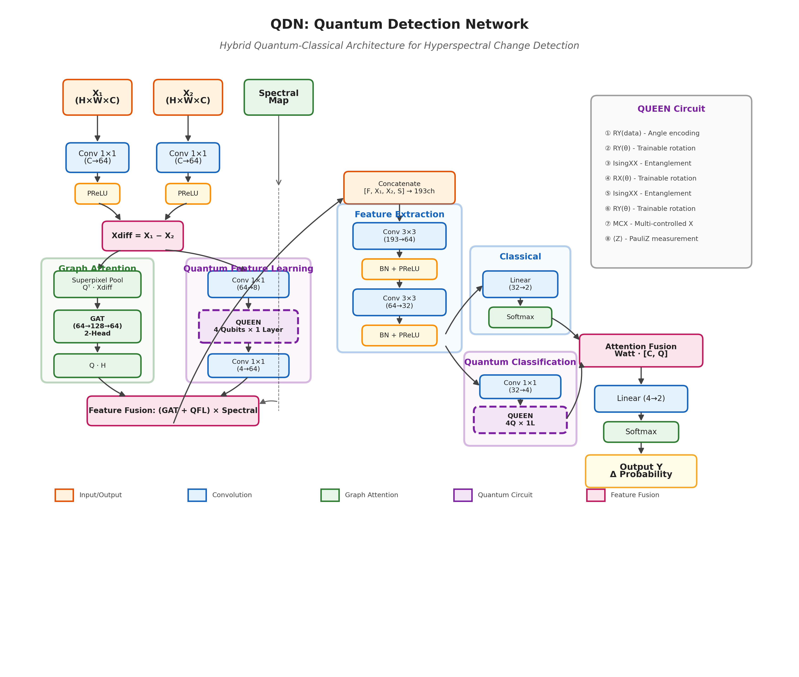

# Quantum Detection Network (QDN) Architecture

## Overview

The Quantum Detection Network (QDN) is a hybrid quantum-classical neural network designed for hyperspectral image change detection. It combines Graph Attention Networks (GAT) with Parameterized Quantum Circuits (PQC) to leverage both classical deep learning and quantum computing paradigms.



> **Note:** An editable draw.io file (`qdn_architecture.drawio`) is also available for further customization. Open it at [diagrams.net](https://app.diagrams.net/) or with any draw.io compatible editor.

## Architecture Components

### 1. Input Processing

The network takes three inputs:
- **X₁**: First hyperspectral image (H × W × C)
- **X₂**: Second hyperspectral image (H × W × C)
- **Spectral Map**: Spectral attention weights (H × W × 1)

### 2. Dimension Reduction

Two parallel 1×1 convolution layers reduce the spectral dimensionality:
- `dim_reduc_conv1`: C → 64 channels
- `dim_reduc_conv2`: C → 64 channels

### 3. Difference Computation

```
X_diff = X₁ - X₂
```

The difference features capture temporal changes between the two images.

### 4. Graph Attention Branch

Processes spatial relationships using superpixel-based graph:

1. **Superpixel Pooling**: `Q^T · X_diff` aggregates pixel features to superpixel level
2. **GAT Network**: 2-head attention with hidden dimension 128
3. **Feature Projection**: `Q · H` projects back to pixel level

### 5. Quantum Feature Learning (QFL)

Enhances difference features using quantum circuits:

1. **DR3 Conv**: 64 → 8 channels
2. **QUEEN Circuit**: 4-qubit parameterized quantum circuit
3. **Spec Up Conv**: 4 → 64 channels

### 6. Feature Fusion

Combines graph and quantum features:
```
Feature = (GAT_output + QFL_output) × Spectral_Map
Concatenated = [Feature, X₁, X₂, Spectral_Map]  # 193 channels
```

### 7. Feature Extraction

Sequential convolution layers:
- Extract Conv: 193 → 64 channels (3×3)
- BatchNorm + PReLU
- Conv: 64 → 32 channels (3×3)
- BatchNorm + PReLU

### 8. Classification Branches

#### Classical Branch
- Linear: 32 → 2
- Softmax

#### Quantum Enhanced Classification (QEC)
- QNN Red Conv: 32 → 4
- QUEEN Circuit (4 qubits)
- Output: 2 values

### 9. Attention Fusion

Final prediction combines both branches:
```
Y = W_att · [Classical_output, Quantum_output]
Final = Softmax(Linear(Y))
```

## QUEEN Quantum Circuit

The QUEEN (QUantum Enhanced Encoding Network) circuit uses:

1. **RY Angle Encoding**: Embeds classical data into quantum states
2. **Trainable RY/RX Rotations**: Parameterized single-qubit gates
3. **IsingXX Entanglement**: Two-qubit entangling gates
4. **Multi-Controlled X**: Additional entanglement layer
5. **PauliZ Measurements**: Extracts quantum features

```
Circuit Structure (per layer):
┌─────────┐ ┌─────────┐ ┌─────────┐ ┌─────────┐ ┌─────────┐ ┌─────────┐
│ RY(data)│─│ RY(θ)   │─│IsingXX  │─│ RX(θ)   │─│IsingXX  │─│ RY(θ)   │─
├─────────┤ ├─────────┤ ├─────────┤ ├─────────┤ ├─────────┤ ├─────────┤
│ RY(data)│─│ RY(θ)   │─│         │─│ RX(θ)   │─│         │─│ RY(θ)   │─
├─────────┤ ├─────────┤ ├─────────┤ ├─────────┤ ├─────────┤ ├─────────┤
│ RY(data)│─│ RY(θ)   │─│IsingXX  │─│ RX(θ)   │─│IsingXX  │─│ RY(θ)   │─
├─────────┤ ├─────────┤ ├─────────┤ ├─────────┤ ├─────────┤ ├─────────┤
│ RY(data)│─│ RY(θ)   │─│         │─│ RX(θ)   │─│         │─│ RY(θ)   │─MCX─
└─────────┘ └─────────┘ └─────────┘ └─────────┘ └─────────┘ └─────────┘
```

## Model Variants

### QDN (Full Model)
Complete architecture with both QFL and QEC.

### QDN_wo_QFL
Without Quantum Feature Learning - uses only QEC for quantum processing.

### QDN_wo_QEC
Without Quantum Enhanced Classification - uses only QFL for quantum features.

### QDN_wo_QFL_QEC
Purely classical baseline without any quantum components.

## Usage

```python
import torch
from vla_pipeline.models import QDN

# Create superpixel matrices
Q = torch.rand(height * width, num_superpixels)  # Assignment matrix
A = torch.rand(num_superpixels, num_superpixels)  # Adjacency matrix

# Initialize model
model = QDN(
    channel=200,      # Number of spectral bands
    class_num=2,      # Binary change detection
    Q=Q,
    A=A
)

# Forward pass
x1 = torch.rand(height, width, channels)  # First image
x2 = torch.rand(height, width, channels)  # Second image
spectral_map = torch.rand(height * width, 1)  # Spectral attention

output, classical_pred, quantum_pred = model(x1, x2, spectral_map)
```

## Dependencies

- PyTorch >= 1.9.0
- PennyLane >= 0.28.0 (for quantum circuits)
- NumPy >= 1.21.0

## References

1. Graph Attention Networks: https://arxiv.org/abs/1710.10903
2. PennyLane Quantum Machine Learning: https://pennylane.ai/
3. Variational Quantum Circuits: https://arxiv.org/abs/1802.06002

## Citation

If you use this model in your research, please cite:

```bibtex
@software{qdn_model,
  title={Quantum Detection Network for Hyperspectral Change Detection},
  year={2025},
  url={https://github.com/maneetchatterjee/maneet}
}
```
